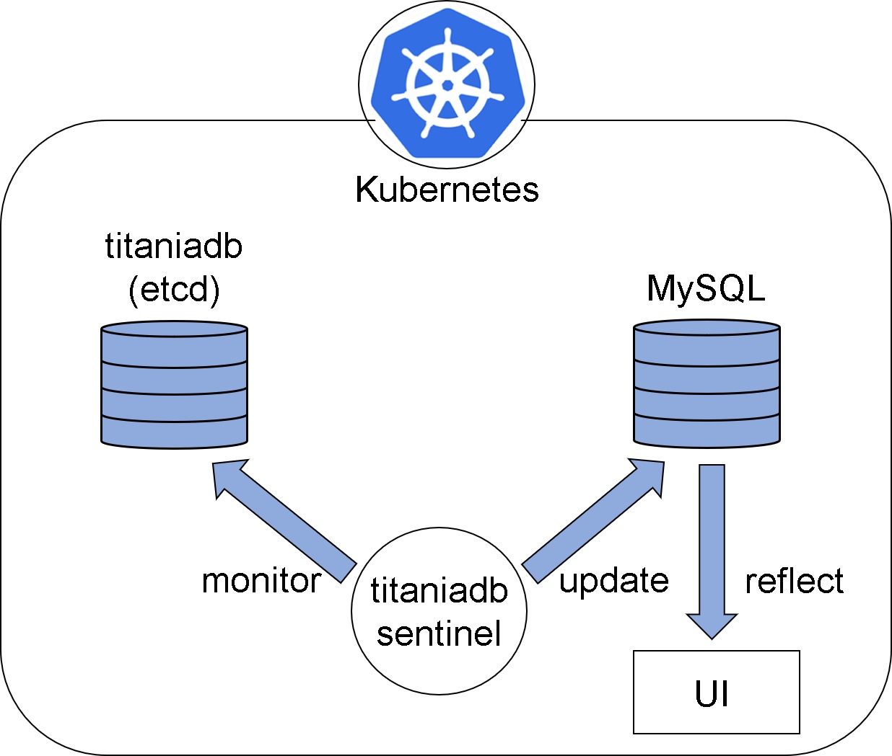

# titaniadb-sentinel

titaniadb-sentinel は、titaniadb を対象として、データベース監視を行うマイクロサービスです。主にエッジ上で動作します。

## 概要
titaniadb-sentinel は、etcd をラップした titaniadb と連携します。このマイクロサービスは、titania が収集したデータが蓄積されたデータベースにおいて、データの置換、挿入が正しく行われるよう監視することができます。

titania は、IP、MAC アドレス、kubernetes ノードの状態、ポッドの状態など、エッジ間の安定したデータインタフェースや処理に重要な IoT メタデータをデータベースに蓄積しますが、titaniadb-sentinel は、これらのデータの置換、挿入が正しく行われるよう巡回します。

### etcdとは
etcd は、オープンソースで分散型のキーバリューストアです。etcd は kubernetes のプライマリーデータストアとして採用されており、kubernetes クラスタの情報を保存、複製しています。

Github URL: https://github.com/etcd-io/etcd

## 動作環境
titaniadb-sentinelは、aion-coreのプラットフォーム上での動作を前提としています。 使用する際は、事前に下記の通りAIONの動作環境を用意してください。   
* ARM CPU搭載のデバイス(NVIDIA Jetson シリーズ等)   
* OS: Linux Ubuntu OS   
* CPU: ARM64   
* Kubernetes   
* [AION](https://github.com/latonaio/aion-core)のリソース    

## セットアップ
以下のコマンドを実行して、docker imageを作成してください。
```
$ cd /path/to/titaniadb-sentinel
$ make docker-build
```

## 起動方法
以下のコマンドを実行して、podを立ち上げてください。
```
$ cd /path/to/titaniadb-sentinel
$ kubectl apply -f k8s/development/deployment.yml

# 本番環境の場合は以下
$ kubectl apply -f k8s/production/deployment.yml
```

## Input／Output

### Input

etcd(titaniadb)に保存されたデータ(Key-Value 型)
titaniadb-sentinel は、etcd に保存されたデータを常時監視します。

### Output

データベース上のデータに起きた、挿入、追加、削除、エラー等のイベントを表示します。また、etcd、MySQL の upsert を行います。

## Install

```
$git clone git@bitbucket.org:latonaio/titaniadb-sentinel.git

$cd titaniadb_sentinel

$make docker-build
```

## File Contents

- etcd.py  
  etcd に蓄積されたデータの key、ID、metadata の取得や、それらのデータの挿入、追加、削除、に対する response を定義しています。  
  Base クラスでは、etcd にストアされたデータの監視の開始、key の取得、挿入、削除を定義しています。
  Device クラス、Pod クラスでは、Base クラスを継承し、それぞれ Device、Pod に関するデータの操作を定義します。
- main.py  
  etcd.py、mysql.py で定義された内容に従って処理を実行し、各データベースの upsert や、処理内容、エラー内容の出力を行います。
  upsert_at_event メソッドでは、event の type に従って処理を行います。
- mysql.py  
  MySQL への接続、カーソルの取得、データの操作など、データベース内のデータの操作方法を定義しています。  
  BaseTable クラスは、データベースへの接続、カーソルの取得、データの取得などを定義しています。DeviceTable クラス、PodTable クラスでは、BaseTable クラスを継承し、それぞれ Device、Pod に関するデータの操作を定義します。
- deployment.yml  
  deployment は、Pod と ReplicaSet の宣言的なアップデート機能を提供するために作成される yaml ファイルです。
- Dockerfile
- Makefike
- docker-build.sh
- requirements.txt

## System Configuration


