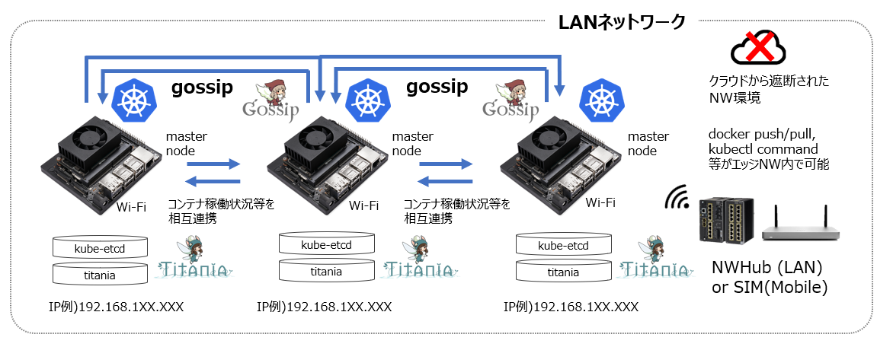

# titaniadb-sentinel
titaniadb-sentinelは、エッジ上で、titaniadb(etcd) を対象として、データベースの監視、制御を行うマイクロサービスです。


## Description
titaniadb-sentinel は、etcdをラップしたエッジ上のtitaniadbと連携します。  
このマイクロサービスは、titaniadb-sentinel が収集したデータが蓄積されたtitaniadbにおいて、データの置換、挿入が正しく行われるよう監視、制御することができます。  

titaniadbは、エッジ上の IP、MACアドレス、kubernetesノードの状態、ポッドの状態など、エッジ間の安定したデータインタフェースや処理に重要なIoTメタデータをデータベースに蓄積しますが、titaniadb-sentinelは、エッジ上で、これらのデータの置換、挿入が正しく行われるよう巡回、制御します。  


## 依存関係  

- [distributed-service-discovery](https://github.com/latonaio/distributed-service-discovery)  
- [gossip-propagation-d](https://github.com/latonaio/gossip-propagation-d)  


## etcd
etcdは、オープンソースで分散型のキーバリューストアです。etcd はkubernetes のプライマリーデータストアとして採用されており、kubernetesクラスタの情報を保存、複製しています。  
Github URL: https://github.com/etcd-io/etcd
## Input／Output  
エッジクラスター内の各エッジノード端末において、titaniadbと連携して、データの制御、監視を行います。具体的には、titaniadbのデータを監視、取得、更新、追加、削除したり、ログ、エラー等のイベントの表示をしたりします。  
また、MySQLに静的な結果データのアップデートを行います。  

## Install
```
$git clone git@bitbucket.org:latonaio/titaniadb-sentinel.git 

$cd titaniadb_sentinel  

$make docker-build
```

## File Contents
* etcd.py   
etcdに蓄積されたデータのkey、ID、metadataの取得や、それらのデータの挿入、追加、削除、に対するresponseを定義しています。  
Baseクラスでは、etcdにストアされたデータの監視、制御の開始、keyの取得、挿入、削除を定義しています。
Deviceクラス、Podクラスでは、Baseクラスを継承し、それぞれDevice、Podに関するデータの操作を定義します。
* main.py  
etcd.py、mysql.py で定義された内容に従って処理を実行し、各データベースのupsertや、処理内容、エラー内容の出力を行います。
upsert_at_eventメソッドでは、eventのtypeに従って処理を行います。
* mysql.py  
MySQLへの接続、カーソルの取得、データの操作など、データベース内のデータの操作方法を定義しています。  
BaseTableクラスは、データベースへの接続、カーソルの取得、データの取得などを定義しています。DeviceTableクラス、PodTbaleクラスでは、BaseTableクラスを継承し、それぞれDevice、Podに関するデータの操作を定義します。  
* deployment.yml  
deploymentは、PodとReplicaSetの宣言的なアップデート機能を提供するために作成されるyamlファイルです。  
* Dockerfile
* Makefike
* docker-build.sh
* requirements.txt
