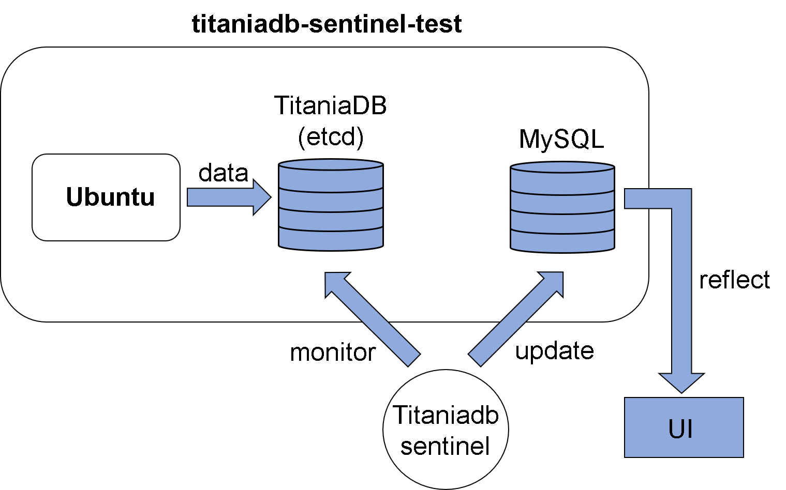

## titaniadb-sentinel-test
titaniadb-sentinel-testは、titaniadb-sentinelのテストの為に作られたmockサーバーです。


## 概要
titaniadb-sentinel-testは、etcd、MySQL、ubuntuの三つのコンテナによって構成されています。titaniadb-sentinel-testを使用することで、titaniadb-sentinelの動作とOutputの確認を行うことができます。

## 起動方法
以下のコマンドによりtitaniadb-sentinel-testを起動してください。

```
$ cd test
$ docker-compose up
```

## システム構造


## 使用したdocker image
### bitnami/etcd
　-https://hub.docker.com/r/bitnami/etcd/dockerfile
### ubuntu
  -https://hub.docker.com/_/ubuntu
### mysql
  -https://hub.docker.com/_/mysql
