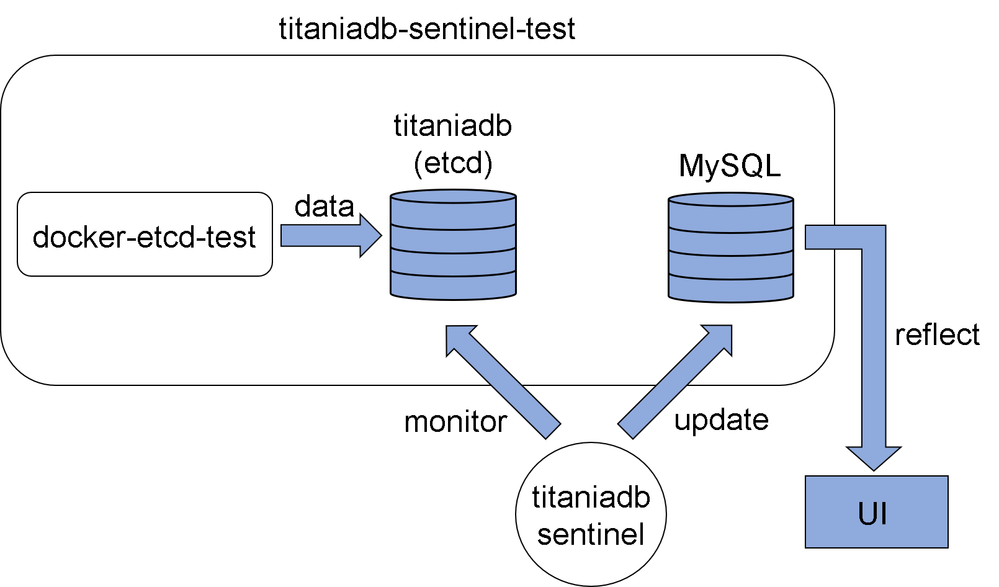

## titaniadb-sentinel-test
titaniadb-sentinel-testは、titaniadb-sentinelのテスト用mockサーバーです。


## 概要
titaniadb-sentinel-testは、etcd、MySQL、ubuntuの三つのコンテナによって構成されています。titaniadb-sentinel-testを使用することで、titaniadb-sentinelの動作とOutputの確認を行うことができます。

## 起動方法
以下のコマンドによりtitaniadb-sentinel-testを起動してください。

```
$ cd test
$ docker-compose up
```

## Input
JSON形式のデータ。etcdに送られるデータの内容はtest_etcd.pyに記載されています。

## Output
MySQLへのデータ入力。MySQL内に保存されたデータは以下のコマンドによって確認することができます。

```
$ cd titaniadb-sentinel
$ docker exec -it [コンテナ名] bash
$ docker mysql -u root -p
$ use [データベース名]
$ select * from [テーブル名]
```

## システム構造


## 使用したdocker image
### bitnami/etcd
　-https://hub.docker.com/r/bitnami/etcd/dockerfile
### ubuntu
  -https://hub.docker.com/_/ubuntu
### mysql
  -https://hub.docker.com/_/mysql
